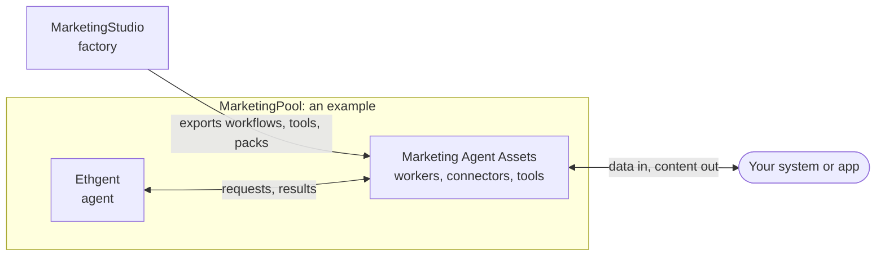
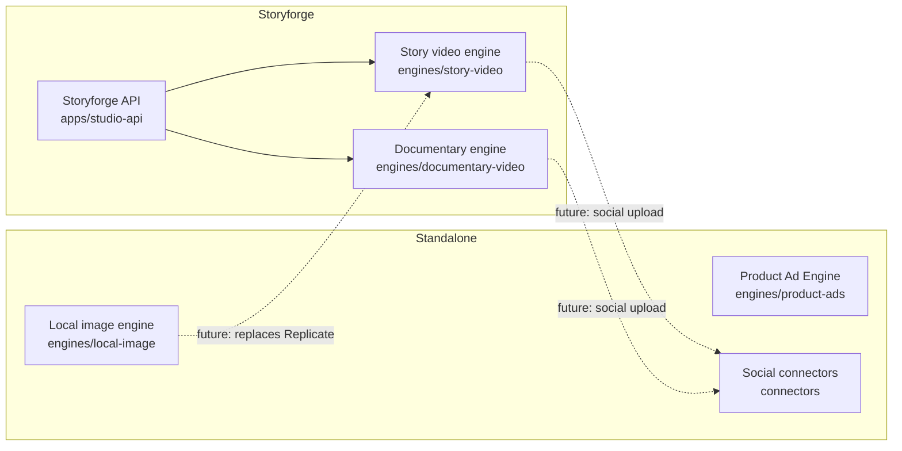

<div align="center">

# MarketingStudio

**The factory: turn capabilities into workflows, and workflows into tools that an agent or a worker can run.**


[](https://github.com/Ahmet2001/MarketingStudio/stargazers)
[](https://github.com/Ahmet2001/MarketingStudio/issues)
[](https://github.com/Ahmet2001/MarketingStudio/commits/main)


[Big picture](#the-big-picture) · [How it works](#how-the-factory-works) · [Exports](#what-an-export-can-become) · [What ships with it](#what-ships-with-the-studio) · [Setup](#setup-requirements) · [Roadmap](#scope-and-roadmap) · [Contributing](#contributing)

</div>

MarketingStudio is where capabilities are **made into new capabilities**. You write small engines (often one Python file), join them in a workflow of any shape, check it, run it locally to try it, and export it. The export is a neutral, self-contained bundle. Small adapters reshape the bundle for whoever will run it: an LLM agent, a queue worker, an MCP client.

It is one part of a larger idea: fitting an LLM agent to a system. The Studio is the **factory** that makes the tools; [Ethgent](https://github.com/Ahmet2001/BrowserAgent) is the agent that uses them, [Marketing Agent Assets](https://github.com/Ahmet2001/MarketingPool/tree/main/marketing-agent-assets) is the open pool that connects the agent to a system, and [MarketingPool](https://github.com/Ahmet2001/MarketingPool) is the example where those meet. The reasoning is in the [main manifesto](https://github.com/Ahmet2001/MarketingPool/blob/main/manifesto.md).

The Studio depends on none of them. A workflow is not tied to the pool, and an exported workflow runs without the Studio installed.

## The big picture

Four repositories, one idea: **take an LLM agent and fit it to your own system.** None of them is a placeholder for another.

| Repository | Role |
| --- | --- |
| [**Ethgent**](https://github.com/Ahmet2001/BrowserAgent) | The customisable agent. An orchestrator LLM, sub-agents and tools that live in YAML and packs. Today it is tuned for social media; the same shape can be tuned for trading, HR or any other domain. |
| [**Marketing Agent Assets**](https://github.com/Ahmet2001/MarketingPool/tree/main/marketing-agent-assets) | The integration layer and an open pool. Workers, connectors, tools, schemas and decision guides that plug the agent into *your* system. Nobody owns "the" asset: anyone can add their own tool, connector or worker. |
| [**MarketingStudio**](https://github.com/Ahmet2001/MarketingStudio) | The factory. Build a workflow once, export it (agent pack, MCP server, worker, ...) and feed it to the agent and the assets. |
| [**MarketingPool**](https://github.com/Ahmet2001/MarketingPool) | One worked example: the agent and the assets together, with Docker, running on one machine. |



Once the agent and the assets are joined, the LLM gets feedback from the system (it can read your data) and can give something back (it can publish, or write into your app). Connected to your app, it can collect material from it, create content and publish it.

## How the factory works

Every engine and connector describes itself in a `capability.yaml` next to its code: what it does, its inputs and outputs, what it needs, whether it changes anything outside the machine (those require approval), and how to run it. See the [capability spec](docs/capability-spec.md).

Your own engine can be one Python file with a `CAPABILITY` literal (inputs and outputs come from the function signature), so a whole system is two files: the engine and the workflow ([example](examples/single_file)). Workflows are files you write freely: any number of steps, branches and parallel steps, using any capability from any source. They are not tied to a fixed template or to the Marketing Assets Pool. The factory checks them and exports each one as a new capability:

```bash
pip install pyyaml
python -m studio validate examples/workflows/parallel_videos.yaml
python -m studio export examples/workflows/story_to_youtube.yaml --out ./exported
python -m studio capabilities --sources ./my_tools ~/shared_pool     # any sources you choose
python -m studio describe story.video.generate                      # what a capability takes, gives and needs
python -m studio plan workflow.yaml --sources ./my_tools            # what a run would involve (runs nothing)
python -m studio new engine my_tools/x.py --id team.x               # starting files
python -m studio run workflow.yaml --sources ./my_tools --input topic="..."   # run it locally
```

Guide: [docs/workflows.md](docs/workflows.md). A workflow can also leave as a self-contained bundle (`python -m studio bundle`) and be reshaped for a consumer with `python -m studio adapt --target agent-pack|agent-bundle|tool-schema|job-handler|worker|mcp`; see [docs/adapters.md](docs/adapters.md). Check capability files from any folder with `python -m studio check --sources DIR`.

An experimental, removable, read-only viewer lives in [ui/](ui/README.md) (`python -m ui`): list workflows and capabilities, and see what each export format produces.

## What an export can become

`python -m studio bundle` produces the neutral bundle. `python -m studio adapt --target <name>` reshapes it for one consumer. An adapter only writes files.

| Target | For | Result |
|---|---|---|
| `agent-pack` | An agent app such as Ethgent | `plugin.yaml` and one self-contained tool file |
| `agent-bundle` | The same, with a sub-agent that owns the tool | Pack plus agent config and prompt |
| `tool-schema` | Any LLM function-calling setup | Tool definitions (Anthropic and OpenAI shapes) |
| `job-handler` | A worker you already run | One `handler.py` |
| `worker` | A standalone queue worker | File or Supabase queue, migration, Dockerfile, per-step approval |
| `mcp` | Any MCP client | A stdio MCP server offering the workflow as a tool |

A step that changes something outside the machine (publishing, for example) always needs approval, and the exports carry that rule with them. Details: [docs/adapters.md](docs/adapters.md).

## What ships with the Studio

The Studio comes with engines and connectors you can use as capabilities, or replace with your own. They were built separately and live side by side in this repository; they are independent applications with a shared folder layout, and only some of them talk to each other. Every component has its own dependencies and its own `.env`.

### At a glance

| # | Application | One-line purpose | You give it | You get | Status |
|---|---|---|---|---|---|
| 1 | **[Product Ad Engine](#1-product-ad-engine)** | Turn product photos into ad creatives | Product images, brief | Ad creatives, UGC storyboards, revisions | Working prototype (mock images by default) |
| 2 | **[Storyforge](#2-storyforge-story--documentary-video-platform)** | API that runs the video engines on a schedule | A topic or an idea | Finished vertical videos | Working, publishing step unfinished |
| 3 | **[Video engines](#3-video-engines)** | Generate narrated 9:16 videos from a topic | A topic | An MP4 with voice and captions | Working (CLI) |
| 4 | **[Local image engine](#4-local-image-engine)** | Generate images on your own GPU | A video idea | Storyboard frames (PNG) | Experimental |
| + | **[Social connectors](#5-social-connectors)** | Search, post and reply on Reddit, X, Instagram, YouTube | Credentials, text, media | Published posts, research data | Library of toolboxes |

### How these parts fit together



- **Solid arrows already work.** Storyforge's API launches the two video engines as subprocesses (see `apps/studio-api/app/pipeline.py`).
- **Dotted arrows are not wired yet.** Connectors, the local image engine and the Product Ad Engine currently run on their own.
- Every component has its own dependencies and its own `.env`. You can use any one of them without the rest.

### What is inside

| Path | Part of | Stack |
|---|---|---|
| [apps/studio-api](apps/studio-api) | Storyforge API | FastAPI, Celery, Redis |
| [engines/story-video](engines/story-video) | Video engines | Python |
| [engines/documentary-video](engines/documentary-video) | Video engines | Python |
| [engines/local-image](engines/local-image) | Local image engine (includes upstream Ideogram 4 source) | Python, diffusers |
| [engines/product-ads](engines/product-ads) | Product Ad Engine (Express API) | TypeScript, Express, SQLite |
| [connectors](connectors) | Social connectors | Python |
| [docs](docs) | Research and architecture notes | Markdown |

---

### 1. Product Ad Engine

**Location:** [engines/product-ads](engines/product-ads) · Full guide: [engines/product-ads/README.md](engines/product-ads/README.md)

A headless backend for product marketing creatives, in the spirit of AdCreative.ai (see the [research notes](docs/adcreative-research.md)). You upload product photos through the API, create a project, and generate ad creatives. Every generation is saved, can be revised into a child version, and can be approved.

What it includes:

- REST API for projects, uploads, generations, revisions, approvals and UGC storyboard scenes.
- A model-provider layer to connect OpenAI, Anthropic, Gemini, Replicate, fal, Hugging Face, Ollama or any OpenAI-compatible endpoint, and assign them to LLM, VLM, image and video roles. API keys are stored encrypted (AES-256-GCM).
- A SQLite database and local file storage, so projects survive restarts.

**Honest status:** the default provider draws SVG mockups so the whole flow works without paid keys. Real image and video generation needs a provider adapter. There is a demo user instead of real authentication. The original React frontend was removed.

```bash
cd engines/product-ads
npm install
npm run dev        # API http://127.0.0.1:8787, health at /api/health
```

### 2. Storyforge (story and documentary video API)

**Location:** [apps/studio-api](apps/studio-api) · Full guide: [docs/storyforge.md](docs/storyforge.md)

An API that puts the [video engines](#3-video-engines) behind one interface. Instead of running scripts in a terminal you create projects over HTTP, queue them, and let a scheduler run them again later. The web frontend was removed.

- **Creation modes:** AI-photo stories, Reddit and gameplay stories, real-image stories, historical documentaries. Stock-footage and AI-avatar modes are listed but marked *coming soon*.
- **Workflows:** stored as nodes and edges, with an optional scheduler and social destination, saved and re-run through `/api/workflows`.
- **Prompt assistant:** leave the topic blank and it suggests one.
- **Stack:** FastAPI for the API, Celery workers for generation, Redis as the queue, Celery Beat for scheduling, SQLite for project records.

**Honest status:** generation works. The last step, uploading to the social platform, is not finished.

```bash
docker compose up --build      # API at http://localhost:8000 (docs at /docs), Redis, worker, scheduler
```

### 3. Video engines

These two command-line tools do the actual work behind Storyforge, and they also run on their own. Both take a topic and produce a vertical 1080x1920 MP4 with narration and captions.

| | Story video | Documentary video |
|---|---|---|
| **Location** | [engines/story-video](engines/story-video) | [engines/documentary-video](engines/documentary-video) |
| **Style** | Short narrated stories with a hook and payoff | Factual explainers built on real history |
| **Visuals** | AI-generated scene images (Replicate), or gameplay footage in "video game mode" | Real archive photos from Openverse and Wikimedia Commons, filtered by license |
| **Research** | Gemini plans queries, DuckDuckGo supplies sources | Same, with explicit authentic-photo requirement per scene |
| **Voice and video** | ElevenLabs narration, FFmpeg rendering, animated captions | Same |
| **Personality** | Niche profiles (audience, tone, hooks) as JSON | Question, context, cause, evidence, consequence structure |

Needs Python 3.12+, FFmpeg, and API keys for Gemini and ElevenLabs (plus Replicate for AI images).

```bash
cd engines/story-video
python -m venv .venv && source .venv/bin/activate
pip install -r requirements.txt && cp .env.example .env   # add your keys
python main.py "A taxi driver receives a request from an abandoned town" --duration 20 --scenes 4
```

Documentary example: `python main.py "The 2001 financial crisis in Turkey" --duration 45 --scenes 7` inside [engines/documentary-video](engines/documentary-video). Output lands in `outputs/<timestamp>/`.

### 4. Local image engine

**Location:** [engines/local-image](engines/local-image)

Two things live here:

1. **Ideogram 4**, the upstream open-weight text-to-image model source, kept for reference and experiments. Its own guide is [engines/local-image/README.md](engines/local-image/README.md).
2. **`story_image_pipeline.py`**, our own script: a local Ollama LLM writes a storyboard from your idea, then Stable Diffusion 1.5 renders each frame on your GPU. No cloud keys needed. The `test_*.py` files are quick GPU checks for SD 1.5 and Ideogram in fp8 and nf4.

```bash
cd engines/local-image
python story_image_pipeline.py --idea "An AI student's first day" --out outputs/demo
```

**Honest status:** experimental, not connected to Storyforge yet. The long-term idea is to replace the paid Replicate step in the story engine.

### 5. Social connectors

**Location:** [connectors](connectors)

Large toolboxes (roughly 8,000 lines in total) for working with social platforms. Each one supports both browser automation (Selenium, you sign in normally) and the platform's official API.

| Toolbox | Can do |
|---|---|
| [reddit_toolbox.py](connectors/reddit_toolbox.py) | Search, inspect communities and profiles, post text or links, comment, reply |
| [x_toolbox.py](connectors/x_toolbox.py) | Search, publish posts, threads and media posts, reply, like |
| [instagram_toolbox.py](connectors/instagram_toolbox.py) | Search, publish posts, create image and reel containers, comment, message |
| [youtube_toolbox.py](connectors/youtube_toolbox.py) | Search, publish videos, comment, reply, create playlists |

Use them for low-volume, supervised work and follow each platform's terms and rate limits. `connectors/main.py` is an agent entry point that imports a `MarketingApp` package which is not in this repository yet, so it does not run as-is. The toolboxes import `.araclar.browser_araclari` (and need `selenium`), a package that lives on the server side and not in this repository. Here they are definitions: you can write workflows with them and validate, plan and export, and they run where the toolboxes are installed.

---

## Setup requirements

- Node.js 20+ for the Product Ad Engine
- Python 3.12+ for engines, connectors and the Storyforge API
- FFmpeg for the video engines
- Docker with Compose for Storyforge
- A CUDA GPU for the local image engine (optional)

Each component reads its own `.env`. Copy the `.env.example` next to it first (see the root [.env.example](.env.example) for the list).

## Secrets and generated files

Real `.env` files, generated media (`outputs/`, mp4, wav, mp3), `node_modules`, virtualenvs and runtime databases are git-ignored. Never commit API keys.

## Scope and roadmap

**Today:** a person writes a workflow (or a single-file engine), checks it with `plan`, exports it, and moves the result to the server side where the agent or worker runs it. The Studio is used by people.

**Future work, deliberately not started:** an agent that uses the Studio itself (discovering capabilities, composing and registering workflows on its own), a programmatic or MCP interface to the Studio, agent-assisted troubleshooting, budgets and approval policies. Nothing in the format blocks this: workflows, capabilities and bundles are plain structured files.

**Not done yet in the person-driven flow:**

- Real keys have not been run through `story-video` and `documentary-video` via `studio run`, so their capability descriptions are unconfirmed against real output
- The connectors are definitions only until they are importable (they need a package that is not in this repository)
- A shared engine interface for the older engines; real image and video providers for the Product Ad Engine
- Approvals do not travel over the `mcp` export: a workflow that needs approval is refused there

## Help

Open an [issue](https://github.com/Ahmet2001/MarketingStudio/issues) for bugs or questions.

## Maintainer

[@Ahmet2001](https://github.com/Ahmet2001)

## License

This repository does not have a top-level license yet. [engines/local-image](engines/local-image) contains upstream Ideogram 4 code under the Apache License 2.0 ([LICENSE.md](engines/local-image/LICENSE.md)) and model licenses in [model_licenses](engines/local-image/model_licenses).

## Contributing

Contributions are welcome. Open an issue to discuss a change before sending a pull request, keep each pull request to one component, and do not include secrets or generated media.
